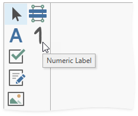

# Add a Custom Control to the End-User Report Designer Toolbox (WPF)

This example demonstrates how to add a [custom numeric label control](https://docs.devexpress.com/XtraReports/3307) to the [End-User Report Designer](https://docs.devexpress.com/XtraReports/114104) Toolbox in a WPF application.

Files to look at:

* CS: [NumericLabel.cs](https://github.com/DevExpress-Examples/Reporting_wpf-end-user-report-designer-how-to-register-a-custom-control-in-the-designers-t416384/blob/2020.2/CS/NumericLabel.cs) and [MainWindow.xaml.cs](https://github.com/DevExpress-Examples/Reporting_wpf-end-user-report-designer-how-to-register-a-custom-control-in-the-designers-t416384/blob/2020.2/CS/MainWindow.xaml.cs).
* VB: [NumericLabel.vb](https://github.com/DevExpress-Examples/Reporting_wpf-end-user-report-designer-how-to-register-a-custom-control-in-the-designers-t416384/blob/2020.2/VB/NumericLabel.vb) and [MainWindow.xaml.vb](https://github.com/DevExpress-Examples/Reporting_wpf-end-user-report-designer-how-to-register-a-custom-control-in-the-designers-t416384/blob/2020.2/VB/MainWindow.xaml.vb).

Refer to the following topic for more details: [Add a Custom Control to the Report Designer Toolbox (WPF)](https://docs.devexpress.com/XtraReports/116767).